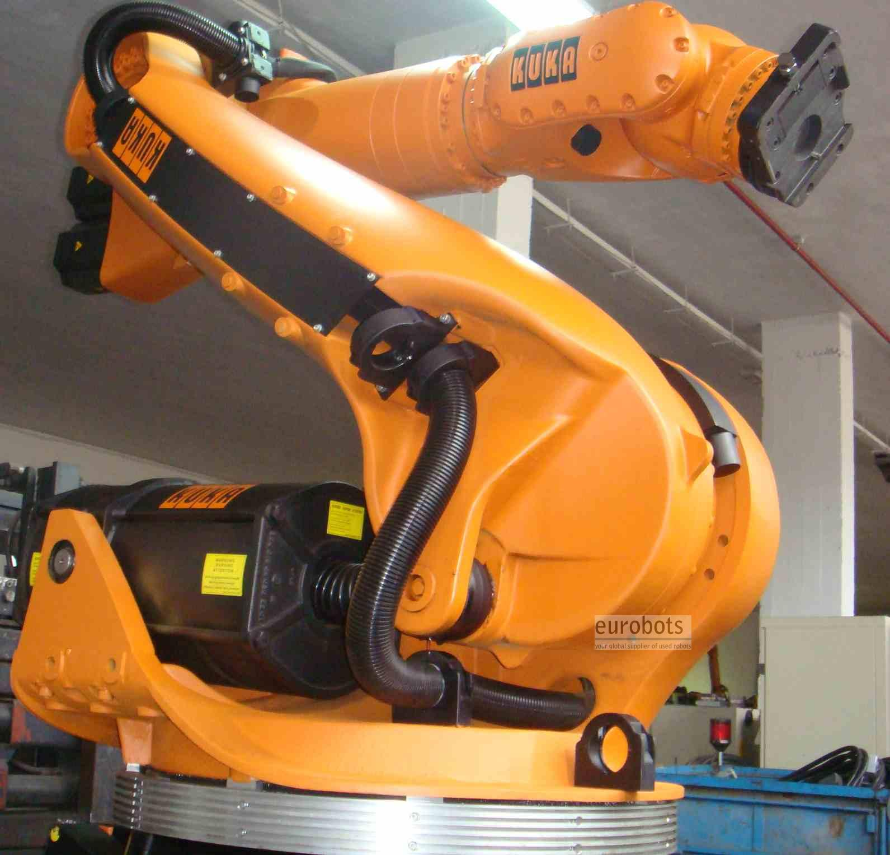
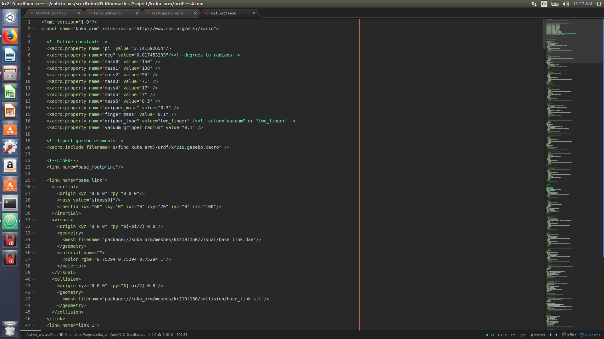
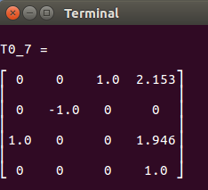
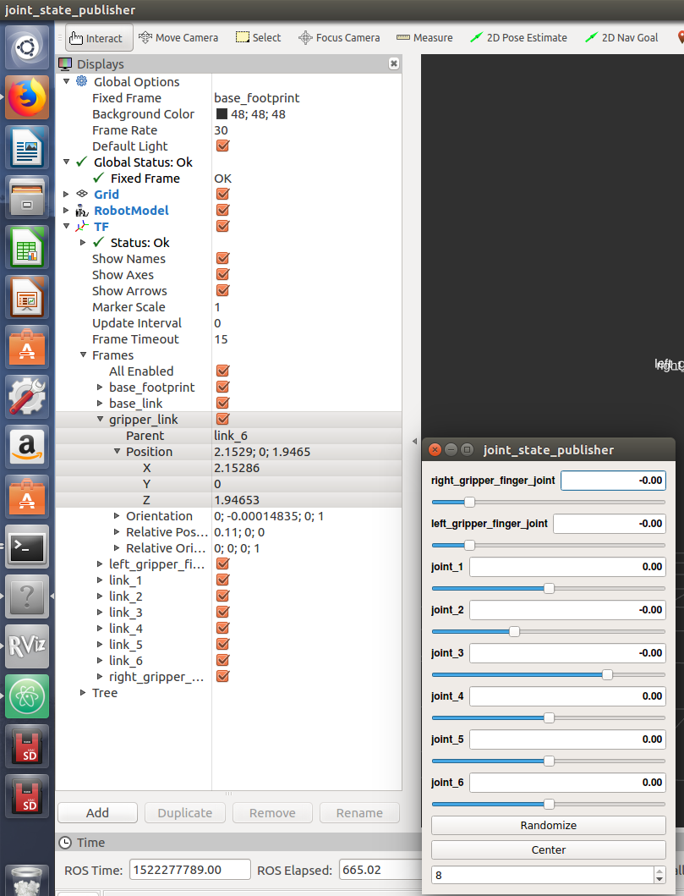
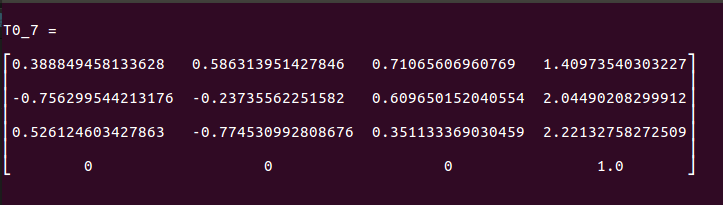
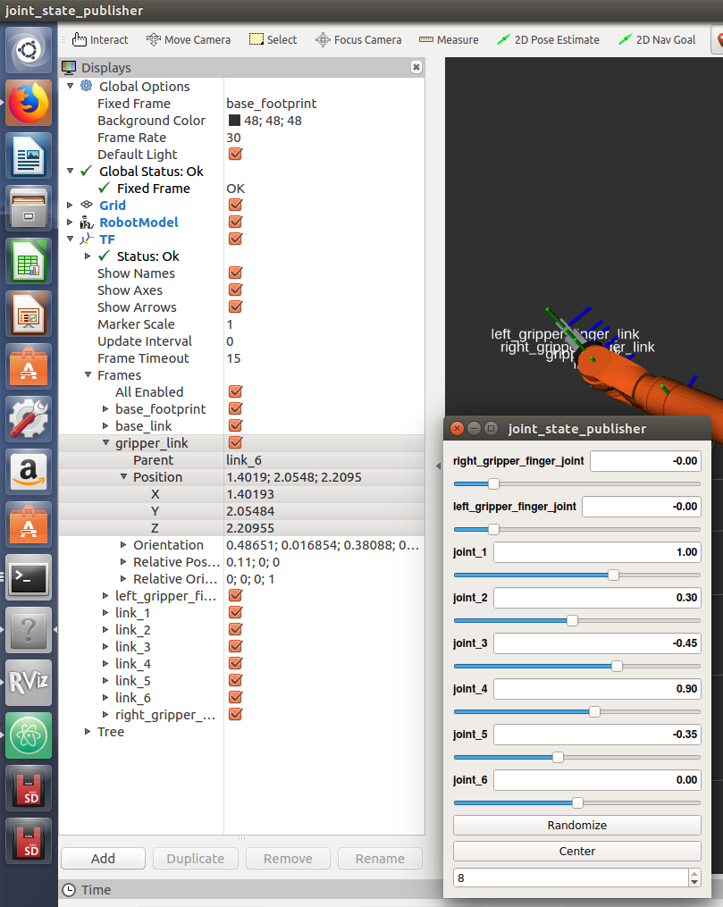

[![Udacity - Robotics NanoDegree Program]
# Robotic arm - Pick & Place project
## Using the KUKA KR 210

## Setting up the enviroment:
For this project used the following programs:
- Ubuntu 16.04 LTS OS
- Ros Luna 1.13.6
- Gazebo 7.9
- Rviz 1.12.15
## Installation steps:
- Clone this repository to your home directory:
```
$ git clone https://github.com/mkhuthir/RoboND-Kinematics-Project.git ~/catkin_ws
```
- As this project uses custom Gazebo 3D models, we need to add the path through environment variable:
```
$ echo "export GAZEBO_MODEL_PATH=~/catkin_ws/src/kuka_arm/models" >> ~/.bashrc
```
- Install missing ROS dependencies using the rosdep install command:
```
$ cd ~/catkin_ws/
$ rosdep install --from-paths src --ignore-src --rosdistro=kinetic -y
```
- Run catkin_make from within your workspace to build the project:
```
$ cd ~/catkin_ws/
$ catkin_make
```
- Run the following shell commands to source the setup files:
```
$ echo "source ~/catkin_ws/devel/setup.bash" >> ~/.bashrc
```
- For demo mode make sure the demo flag is set to ```true``` in ```inverse_kinematics.launch``` file under ```~/catkin_ws/src/kuka_arm/launch/```

- You can also control the spawn location of the target object in the shelf by modifying the spawn_location argument in ```target_description.launch``` file under ```~/catkin_ws/src/kuka_arm/launch/```. 0-9 are valid values for spawn_location with 0 being random mode.

- To run forward kinematics test us:
```
$ roslaunch kuka_arm forward_kinematics.launch
```
- To run simulator use:
```
$ rosrun kuka_arm safe_spawner.sh
```
- To run IK Server use:
```
$ rosrun kuka_arm IK_server.py
```
## Forward Kinematics
### Unified Robot Description Format (URDF)
This file provided all the information about the ```Kuka kr 210``` structrure ```Links, joints,Transmission, Actuators , and physics properties``` for the gazebo environment.



with this file we extract the following information that will be useful for the next steps:

| O             |Joint          |Parent          | Child       |x     |y    |z      |
| ------------- |:-------------:| --------------:| -----------:|-----:|----:|------:|
| 0             | Fixed_base    | Base_footprint | Base_link   | 0    | 0   | 0     |
| 1             | Joint_1       | Base_link      | link_1      | 0    | 0   | 0.33  |
| 2             | Joint_2       | link_1         | link_2      | 0.35 | 0   | 0.42  |
| 3             | Joint_3       | link_2         | link_3      | 0    | 0   | 1.25  |
| 4             | Joint_4       | link_3         | link_4      | 0.96 | 0   | -0.054|
| 5             | Joint_5       | link_4         | link_5      | 0.54 | 0   | 0     |
| 6             | Joint_6       | link_5         | link_6      | 0.193| 0   | 0     |
| 7             | End-Effector  | link_6         | gripper_link| 0.11 | 0   | 0.33  |
| Total         |               |                |             | 2.153| 0   | 1.946 |                                         | ------------- |---------------|----------------|-------------| ----:| ---:| -----:|

### Denavit-Hantenberg

Now we perform the DH procedure on the ```kuka kr 210``` diagram as follows:


Once we have the diagram, we will fulfill the DH parameters ``` alpha,a, d, theta ```

| i             |alpha(i-1)     | a(i-1)         | d(i)        | theta(i)   |
| ------------- |:-------------:| --------------:| -----------:|-----------:|
| 1             | 0             | 0              | 0.75        | 0          |
| 2             | -90           | 0.35           | 0           | q2 - 90    |
| 3             | 0             | 1.25           | 0           | 0          |
| 4             | -90           | -0.054         | 1.50        | 0          |
| 5             | 90            | 0              | 0           | 0          |
| 6             | -90           | 0              | 0           | 0          |
| 7             | 0             | 0              | 0.303       | 0          |

### Implementation of the Forward Kinematics on Python
First of all we need to import some useful libraries for this project.
```Python
import rospy
import tf
from kuka_arm.srv import *
from trajectory_msgs.msg import JointTrajectory, JointTrajectoryPoint
from geometry_msgs.msg import Pose
from mpmath import *
from sympy import *
```

Additionally we must represent the DH parameters in the code, so we need the symbols.
```Python
# Create symbols
q1, q2, q3, q4, q5, q6, q7 = symbols('q1:8')
d1, d2, d3, d4, d5, d6, d7 = symbols('d1:8')
a0, a1, a2, a3, a4, a5, a6 = symbols('a0:7')
alpha0, alpha1, alpha2, alpha3, alpha4, alpha5, alpha6 = symbols('alpha0:7')

# Create Modified DH parameters
s = {alpha0:    0,  a0:   0, d1: 0.75, q1: q1,
     alpha1: -pi/2,  a1:     0.35, d2: 0, q2: q2 - pi/2,
     alpha2:    0,  a2:     1.25, d3: 0, q3: q3,
     alpha3: -pi/2,  a3: -0.054, d4: 1.50, q4: q4,
     alpha4:  pi/2,  a4:     0, d5: 0, q5: q5,
     alpha5: -pi/2,  a5:     0, d6: 0, q6: q6,
     alpha6:      0,  a6:     0, d7: 0.303, q7: 0}
```
Now it is time to build our individual transform matrices between different links.


Each matrix is composed by 4 matrices, 2 rotations and 2 translations, performed in the following order.


On Python code this is represented as follows:
```Python
# Individual Transformations
# Homogeneuos Transformation Link_0 to link_1
T0_1 = Matrix([[cos(q1),       -sin(q1),        0,      a0],
               [sin(q1)*cos(alpha0), cos(q1)*cos(alpha0), -sin(alpha0), -sin(alpha0)*d1],
               [sin(q1)*sin(alpha0), cos(q1)*sin(alpha0),  cos(alpha0),  cos(alpha0)*d1],
               [0,        0,      0,      1]])
T0_1 = T0_1.subs(s)
# Homogeneuos Transformation Link_1 to link_2
T1_2 = Matrix([[cos(q2),       -sin(q2),        0,      a1],
               [sin(q2)*cos(alpha1), cos(q2)*cos(alpha1), -sin(alpha1), -sin(alpha1)*d2],
               [sin(q2)*sin(alpha1), cos(q2)*sin(alpha1),  cos(alpha1),  cos(alpha1)*d2],
               [0,        0,      0,      1]])
T1_2 = T1_2.subs(s)
# Homogeneuos Transformation Link_2 to link_3
T2_3 = Matrix([[cos(q3),       -sin(q3),        0,      a2],
               [sin(q3)*cos(alpha2), cos(q3)*cos(alpha2), -sin(alpha2), -sin(alpha2)*d3],
               [sin(q3)*sin(alpha2), cos(q3)*sin(alpha2),  cos(alpha2),  cos(alpha2)*d3],
               [0,        0,      0,      1]])
T2_3 = T2_3.subs(s)
# Homogeneuos Transformation Link_3 to link_4
T3_4 = Matrix([[cos(q4),       -sin(q4),        0,      a3],
               [sin(q4)*cos(alpha3), cos(q4)*cos(alpha3), -sin(alpha3), -sin(alpha3)*d4],
               [sin(q4)*sin(alpha3), cos(q4)*sin(alpha3),  cos(alpha3),  cos(alpha3)*d4],
               [0,        0,      0,      1]])
T3_4 = T3_4.subs(s)
# Homogeneuos Transformation Link_4 to link_5
T4_5 = Matrix([[cos(q5),       -sin(q5),        0,      a4],
               [sin(q5)*cos(alpha4), cos(q5)*cos(alpha4), -sin(alpha4), -sin(alpha4)*d5],
               [sin(q5)*sin(alpha4), cos(q5)*sin(alpha4),  cos(alpha4),  cos(alpha4)*d5],
               [0,        0,      0,      1]])
T4_5 = T4_5.subs(s)
# Homogeneuos Transformation Link_5 to link_6
T5_6 = Matrix([[cos(q6),       -sin(q6),        0,      a5],
               [sin(q6)*cos(alpha5), cos(q6)*cos(alpha5), -sin(alpha5), -sin(alpha5)*d6],
               [sin(q6)*sin(alpha5), cos(q6)*sin(alpha5),  cos(alpha5),  cos(alpha5)*d6],
               [0,        0,      0,      1]])
T5_6 = T5_6.subs(s)
# Homogeneuos Transformation Link_6 to link_7 (Gripper)
T6_G = Matrix([[cos(q7),       -sin(q7),        0,      a6],
               [sin(q7)*cos(alpha6), cos(q7)*cos(alpha6), -sin(alpha6), -sin(alpha6)*d7],
               [sin(q7)*sin(alpha6), cos(q7)*sin(alpha6),  cos(alpha6),  cos(alpha6)*d7],
               [0,        0,      0,      1]])
T6_G = T6_G.subs(s)
```
Then all the matrices are multiplied so that we can have a relation of all frames from the Base to the End-Effector.
```Python
# Transform from Base link to end effector (Gripper)
# Important: If we multiply in conjunction the result is different.
T0_2 = (T0_1 * T1_2)  # Link_0 to Link_2
T0_3 = (T0_2 * T2_3)  # Link_0 to Link_3
T0_4 = (T0_3 * T3_4)  # Link_0 to Link_4
T0_5 = (T0_4 * T4_5)  # Link_0 to Link_5
T0_6 = (T0_5 * T5_6)  # Link_0 to Link_6
T0_7 = (T0_6 * T6_G)  # Link_0 to Link_7
```
The matrix ``` T0_7 ``` has the information about the ```rotation, translation, perspective, and scale``` of the ```kuka kr 210``` with the following structure:


## Testing the Forward Kinematics

To verify is the FK is correct, we assigned all the values of the joints ```q1 ,q2 ,q3 ,q4, q5 ,q6 ,q7 ``` equal to `0`. Giving us the following matrix:


And in the simulation give us this values:


For the second test, we changed the values of the joints to ``` q1 = 1; q2 = 0.30; q3 = -0.45; q4 = 0.90; q5 = -0.35; q6 = 0; q7 = 0;```. The matrix give us the following values:



Also the simulation had the same values as in the next image:




