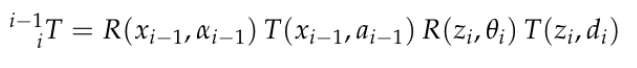
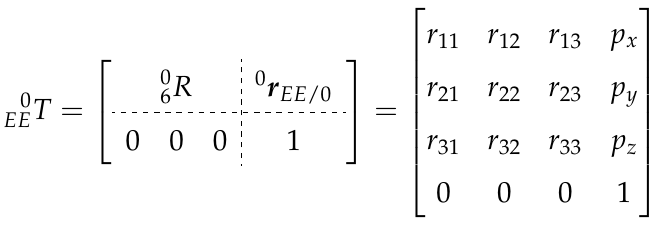
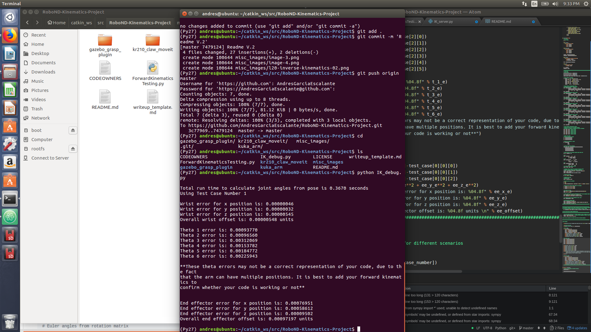

# Robotic arm - Pick & Place project
## Using the KUKA KR 210
## Andres Ricardo Garcia Escalante


## Setting up the enviroment:
For this project used the following programs:
- Ubuntu 16.04 LTS OS
- Ros Luna 1.13.6
- Gazebo 7.9
- Rviz 1.12.15
- Python 2.7

## Installation steps:
- Clone this repository to your home directory:
```
$ git clone https://github.com/mkhuthir/RoboND-Kinematics-Project.git ~/catkin_ws
```
- As this project uses custom Gazebo 3D models, we need to add the path through environment variable:
```
$ echo "export GAZEBO_MODEL_PATH=~/catkin_ws/src/kuka_arm/models" >> ~/.bashrc
```
- Install missing ROS dependencies using the rosdep install command:
```
$ cd ~/catkin_ws/
$ rosdep install --from-paths src --ignore-src --rosdistro=kinetic -y
```
- Run catkin_make from within your workspace to build the project:
```
$ cd ~/catkin_ws/
$ catkin_make
```
- Run the following shell commands to source the setup files:
```
$ echo "source ~/catkin_ws/devel/setup.bash" >> ~/.bashrc
```
- For demo mode make sure the demo flag is set to ```true``` in ```inverse_kinematics.launch``` file under ```~/catkin_ws/src/kuka_arm/launch/```

- You can also control the spawn location of the target object in the shelf by modifying the spawn_location argument in ```target_description.launch``` file under ```~/catkin_ws/src/kuka_arm/launch/```. 0-9 are valid values for spawn_location with 0 being random mode.

- To run forward kinematics test us:
```
$ roslaunch kuka_arm forward_kinematics.launch
```
- To run simulator use:
```
$ rosrun kuka_arm safe_spawner.sh
```
- To run IK Server use:
```
$ rosrun kuka_arm IK_server.py
```
## Forward Kinematics
### Unified Robot Description Format (URDF)
This file provided all the information about the ```Kuka kr 210``` structrure ```Links, joints,Transmission, Actuators , and physics properties``` for the gazebo environment.


with this file we extract the following information that will be useful for the next steps:

| O             |Joint          |Parent          | Child       |x     |y    |z      |
| ------------- |:-------------:| --------------:| -----------:|-----:|----:|------:|
| 0             | Fixed_base    | Base_footprint | Base_link   | 0    | 0   | 0     |
| 1             | Joint_1       | Base_link      | link_1      | 0    | 0   | 0.33  |
| 2             | Joint_2       | link_1         | link_2      | 0.35 | 0   | 0.42  |
| 3             | Joint_3       | link_2         | link_3      | 0    | 0   | 1.25  |
| 4             | Joint_4       | link_3         | link_4      | 0.96 | 0   | -0.054|
| 5             | Joint_5       | link_4         | link_5      | 0.54 | 0   | 0     |
| 6             | Joint_6       | link_5         | link_6      | 0.193| 0   | 0     |
| 7             | End-Effector  | link_6         | gripper_link| 0.11 | 0   | 0.33  |
| Total         |               |                |             | 2.153| 0   | 1.946 |                                         | ------------- |---------------|----------------|-------------| ----:| ---:| -----:|

### Denavit-Hantenberg

Now we perform the DH procedure on the ```kuka kr 210``` diagram as follows:


Once we have the diagram, we will fulfill the DH parameters ``` alpha,a, d, theta ```

| i             |alpha(i-1)     | a(i-1)         | d(i)        | theta(i)   |
| ------------- |:-------------:| --------------:| -----------:|-----------:|
| 1             | 0             | 0              | 0.75        | 0          |
| 2             | -90           | 0.35           | 0           | q2 - 90    |
| 3             | 0             | 1.25           | 0           | 0          |
| 4             | -90           | -0.054         | 1.50        | 0          |
| 5             | 90            | 0              | 0           | 0          |
| 6             | -90           | 0              | 0           | 0          |
| 7             | 0             | 0              | 0.303       | 0          |

### Implementation of the Forward Kinematics on Python
First of all we need to import some useful libraries for this project.
```Python
import rospy
import tf
from kuka_arm.srv import *
from trajectory_msgs.msg import JointTrajectory, JointTrajectoryPoint
from geometry_msgs.msg import Pose
from mpmath import *
from sympy import *
```

Additionally we must represent the DH parameters in the code, so we need the symbols.
```Python
# Create symbols
q1, q2, q3, q4, q5, q6, q7 = symbols('q1:8')
d1, d2, d3, d4, d5, d6, d7 = symbols('d1:8')
a0, a1, a2, a3, a4, a5, a6 = symbols('a0:7')
alpha0, alpha1, alpha2, alpha3, alpha4, alpha5, alpha6 = symbols('alpha0:7')

# Create Modified DH parameters
s = {alpha0:    0,  a0:   0, d1: 0.75, q1: q1,
     alpha1: -pi/2,  a1:     0.35, d2: 0, q2: q2 - pi/2,
     alpha2:    0,  a2:     1.25, d3: 0, q3: q3,
     alpha3: -pi/2,  a3: -0.054, d4: 1.50, q4: q4,
     alpha4:  pi/2,  a4:     0, d5: 0, q5: q5,
     alpha5: -pi/2,  a5:     0, d6: 0, q6: q6,
     alpha6:      0,  a6:     0, d7: 0.303, q7: 0}
```
Now it is time to build our individual transform matrices between different links.


Each matrix is composed by 4 matrices, 2 rotations and 2 translations, performed in the following order.



On Python code this is represented as follows:
```Python
# Individual Transformations
# Homogeneuos Transformation Link_0 to link_1
T0_1 = Matrix([[cos(q1),       -sin(q1),        0,      a0],
               [sin(q1)*cos(alpha0), cos(q1)*cos(alpha0), -sin(alpha0), -sin(alpha0)*d1],
               [sin(q1)*sin(alpha0), cos(q1)*sin(alpha0),  cos(alpha0),  cos(alpha0)*d1],
               [0,        0,      0,      1]])
T0_1 = T0_1.subs(s)
# Homogeneuos Transformation Link_1 to link_2
T1_2 = Matrix([[cos(q2),       -sin(q2),        0,      a1],
               [sin(q2)*cos(alpha1), cos(q2)*cos(alpha1), -sin(alpha1), -sin(alpha1)*d2],
               [sin(q2)*sin(alpha1), cos(q2)*sin(alpha1),  cos(alpha1),  cos(alpha1)*d2],
               [0,        0,      0,      1]])
T1_2 = T1_2.subs(s)
# Homogeneuos Transformation Link_2 to link_3
T2_3 = Matrix([[cos(q3),       -sin(q3),        0,      a2],
               [sin(q3)*cos(alpha2), cos(q3)*cos(alpha2), -sin(alpha2), -sin(alpha2)*d3],
               [sin(q3)*sin(alpha2), cos(q3)*sin(alpha2),  cos(alpha2),  cos(alpha2)*d3],
               [0,        0,      0,      1]])
T2_3 = T2_3.subs(s)
# Homogeneuos Transformation Link_3 to link_4
T3_4 = Matrix([[cos(q4),       -sin(q4),        0,      a3],
               [sin(q4)*cos(alpha3), cos(q4)*cos(alpha3), -sin(alpha3), -sin(alpha3)*d4],
               [sin(q4)*sin(alpha3), cos(q4)*sin(alpha3),  cos(alpha3),  cos(alpha3)*d4],
               [0,        0,      0,      1]])
T3_4 = T3_4.subs(s)
# Homogeneuos Transformation Link_4 to link_5
T4_5 = Matrix([[cos(q5),       -sin(q5),        0,      a4],
               [sin(q5)*cos(alpha4), cos(q5)*cos(alpha4), -sin(alpha4), -sin(alpha4)*d5],
               [sin(q5)*sin(alpha4), cos(q5)*sin(alpha4),  cos(alpha4),  cos(alpha4)*d5],
               [0,        0,      0,      1]])
T4_5 = T4_5.subs(s)
# Homogeneuos Transformation Link_5 to link_6
T5_6 = Matrix([[cos(q6),       -sin(q6),        0,      a5],
               [sin(q6)*cos(alpha5), cos(q6)*cos(alpha5), -sin(alpha5), -sin(alpha5)*d6],
               [sin(q6)*sin(alpha5), cos(q6)*sin(alpha5),  cos(alpha5),  cos(alpha5)*d6],
               [0,        0,      0,      1]])
T5_6 = T5_6.subs(s)
# Homogeneuos Transformation Link_6 to link_7 (Gripper)
T6_G = Matrix([[cos(q7),       -sin(q7),        0,      a6],
               [sin(q7)*cos(alpha6), cos(q7)*cos(alpha6), -sin(alpha6), -sin(alpha6)*d7],
               [sin(q7)*sin(alpha6), cos(q7)*sin(alpha6),  cos(alpha6),  cos(alpha6)*d7],
               [0,        0,      0,      1]])
T6_G = T6_G.subs(s)
```
Then all the matrices are multiplied so that we can have a relation of all frames from the Base to the End-Effector.
```Python
# Transform from Base link to end effector (Gripper)
# Important: If we multiply in conjunction the result is different.
T0_2 = (T0_1 * T1_2)  # Link_0 to Link_2
T0_3 = (T0_2 * T2_3)  # Link_0 to Link_3
T0_4 = (T0_3 * T3_4)  # Link_0 to Link_4
T0_5 = (T0_4 * T4_5)  # Link_0 to Link_5
T0_6 = (T0_5 * T5_6)  # Link_0 to Link_6
T0_7 = (T0_6 * T6_G)  # Link_0 to Link_7
```
The matrix ``` T0_7 ``` has the information about the ```rotation, translation, perspective, and scale``` of the ```kuka kr 210``` with the following structure:


### Testing the Forward Kinematics

#### Case 1

To verify is the FK is correct, we assigned all the values of the joints ```q1 ,q2 ,q3 ,q4, q5 ,q6 ,q7 ``` equal to `0`. Giving us the following matrix:


And in the simulation give us this values:


#### Case 2

For the second test, we changed the values of the joints to ``` q1 = 1; q2 = 0.30; q3 = -0.45; q4 = 0.90; q5 = -0.35; q6 = 0; q7 = 0;```. The matrix give us the following values:


Also the simulation had the same values as in the next image:


In both cases the results were similar, so we can conclude that the FK of the ```Kuka Kr 210``` is ready.

#### For more testing values just modify the following code : ####


## Inverse Kinematics

The ```Kuka Kr 210 ``` has 6 degrees of freedom, all of them are revolute joints. There are 2 ways to solve the IK, the first one involves a `numerical approach` and the other is known as `closed-form`. For this project we will solve the problem using the second option, the last  3 joints of the `kuka kr  210` have a design that is called `spherical wrist` and which has a common point of intersection called `wrist center`.

The important aspect of the last 3 revolute joints is that they decouple the design into 2 parts  ``` Position and orientation```. The first 3 joints are incharge of the position and the others 3 are responsible of the orientation of the end effector.

The locations of the wrist center and the end  effector are respect to the base as shown in the following image:


The `Homogeneuos Transformation` of the `Kuka Kr 210` has the information of the position of the end effector with respect of the base `px, py, pz` as shown in the next image:



 We also need the orientation of the gripper among the `z axis`, that is `r13, r23, and r33`. So, to have the position of the Wrist center we have to applied the following equation:


#### In the Python Code we had to Correction Needed to Account for Orientation Difference Between Definition of Gripper Link_G in URDF versus DH Convention ####

```Python
# Requested end-effector orientation
(roll, pitch, yaw) = tf.transformations.euler_from_quaternion(
    [req.poses[x].orientation.x,
     req.poses[x].orientation.y,
     req.poses[x].orientation.z,
     req.poses[x].orientation.w])

# Creating symbols for the rotation matrices (Roll, Pitch, Yaw)
r, p, y = symbols('r p y')

# Roll
ROT_x = Matrix([[1,       0,       0],
                [0,  cos(r), -sin(r)],
                [0,  sin(r),  cos(r)]])
# Pitch
ROT_y = Matrix([[cos(p),       0,  sin(p)],
                [0,       1,       0],
                [-sin(p),       0,  cos(p)]])
# Yaw
ROT_z = Matrix([[cos(y), -sin(y),       0],
                [sin(y),  cos(y),       0],
                [0,       0,       1]])
# The rotation matrix amoung the 3 axis
ROT_EE = ROT_z * ROT_y * ROT_x

# Correction Needed to Account for Orientation Difference Between
# Definition of Gripper Link_G in URDF versus DH Convention
ROT_corr = ROT_z.subs(y, radians(180)) * ROT_y.subs(p, radians(-90))
ROT_EE = ROT_EE * ROT_corr
ROT_EE = ROT_EE.subs({'r': roll, 'p': pitch, 'y': yaw})
```

Once we got to this point, we must calculate the respective joints values `q1,q2,q3,q4,q5,q6,q7`.

The calculation of the thetas is divided into 2 parts. The first one is for theta 1,2 and 3 (position control). `Theta1` is the projection of the `WC` in the `x-y` plane.

```python
theta1 = atan2(WC[1], WC[0])
```

For `theta2 and theta 3` we will use the following diagram.


Were links C and A are know, and we have to find the values of B, a, b, and c.For this we will need to applied the Cosine Laws

```python
# find the 3rd side of the triangle
A = 1.50
C = 1.25
B = sqrt(pow((sqrt(WC[0]*WC[0] + WC[1]*WC[1]) - 0.35), 2) + pow((WC[2] - 0.75), 2))

# Cosine Laws SSS to find all inner angles of the triangle
a = acos((B*B + C*C - A*A) / (2*B*C))
b = acos((A*A + C*C - B*B) / (2*A*C))
c = acos((A*A + B*B - C*C) / (2*A*B))

# Find theta2 and theta3
theta2 = pi/2 - a - atan2(WC[2]-0.75, sqrt(WC[0]*WC[0]+WC[1]*WC[1])-0.35)
theta3 = pi/2 - (b+0.036)
```
For the inverse orientation, we must find the values of theta 4,5, and 6. Now using the DH parameters we can obtain the rotations about `0-3 R` and also `0-6 R`. As in the image bellow.


```Python
# Extract rotation matrix R0_3 from transformation matrix T0_3 the substitute angles q1-3
R0_3 = T0_1[0:3, 0:3] * T1_2[0:3, 0:3] * T2_3[0:3, 0:3]
R0_3 = R0_3.evalf(subs={q1: theta1, q2: theta2, q3: theta3})

# Get rotation matrix R3_6 from (transpose of R0_3 * R_EE)
R3_6 = R0_3.transpose() * ROT_EE

# Euler angles from rotation matrix
theta4 = atan2(R3_6[2, 2], -R3_6[0, 2])
theta5 = atan2(sqrt(R3_6[0, 2]*R3_6[0, 2] + R3_6[2, 2]*R3_6[2, 2]), R3_6[1, 2])
theta6 = atan2(-R3_6[1, 1], R3_6[1, 0])
 ```
### Testing Inverse Kinematics
#### Case 1

##### The testing Inverse Kinematics was performed in the following script :#####


Once launched the script, it gives us the following results:



## Project Implementation

For the implementation of the IK, I have done several steps:

- Copied the code from `IK_debug.py` to `IK_server.py`
- Remove all the code lines that demand a lot of proccesors time (simplify).
- Modified the `inverse_kinematics/launch` and the the parameters to `false`

## Problems during the project

-  Not able to compile using `catkin_make`. This was solved by adding `static_cast<bool>()` in several lines of code.

- When executing `./safe_spawner` on the terminal, the end effector is not able to grasp the can. Not even my mentor could solve it. I also tried all the possible solutions from slack.

## Future Improvements
- Being able to grasp the can.
- Optimize the time of the code.
- Reduce possibilities of missing grasping the can with the end effector.
